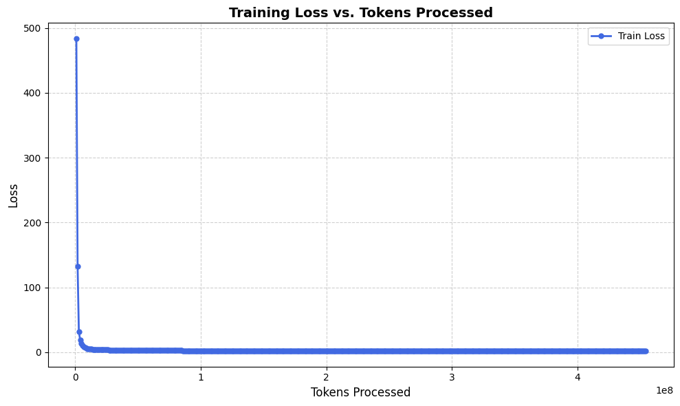

# 🧸 TinyStories Language Model Training

**NanoLanguageModel** is a compact, transformer-based language model for generating short children’s stories. It is ideal for educational, research, or prototyping use — inspired by the paper [_TinyStories: How Small Can Language Models Be and Still Speak Coherent English?_](https://arxiv.org/abs/2305.07759).

> 📦 Implemented in PyTorch and trained on an NVIDIA GeForce RTX 3090.

---

## ⚙️ 1. Training Configuration

| Parameter            | Value           |
|----------------------|-----------------|
| Model Architecture   | GPT-like        |
| Vocabulary Size      | 10,000          |
| Context Length       | 128 tokens      |
| Embedding Size       | 768             |
| Layers               | 2               |
| Attention Heads      | 8               |
| Feedforward Dim      | 3072            |
| Batch Size           | 64              |
| Epochs               | 2               |
| Steps per Epoch      | 28,000          |
| **Total Tokens Seen**| **458,752,000** |
| Device               | CUDA (RTX 3090) |

> ✅ Efficient attention via `torch._native_multi_head_attention`.  
> ⏱ Each epoch takes approximately 49 minutes including validation.

---

## 📈 2. Training & Validation Performance


| Epoch | Train Loss | Train PPL | Valid Loss | Valid PPL |
|-------|------------|-----------|------------|-----------|
| 1     | 2.18       | 8.84      | 2.1062     | 8.22      |
| 2     | 2.01       | 7.49      | 1.9443     | 6.99      |

> 📉 The model converges smoothly with improving perplexity on both training and validation sets.

---

## 📄 3. Sample Outputs

### 🧪 Sample after Epoch 1
```text
<|endoftext|>Hi Jane, have you seen Alice? I can’t find her anywhere,” said Jack.

The little girl looked around and spotted the most beautiful thing in the whole world!

"Let's have a special coin!" said Jane.

So, Jane and Jack took the coin to their home. They gave it to each other and made sure it was the same as they were.
````

### 🧪 Sample after Epoch 2

```text
<|endoftext|>Max had two dogs. One was white and the other was black. Max walked up the street and saw a kid with a dog. He told the kid, “I see you have a Brown dog. I also have a nice dog when I wake up."

The kid said, "That's right, Max. You are so cute. You know how to be dependable and kind. I'm sure we can keep it safe and warm up."

Max smiled and said, "Thank you, kids. I'm glad we...
```

> 🐣 Noticeable improvement in grammar, coherence, and character interaction between epochs.

---

## 🌟 4. Comparative Generation Example

Same story generated on different models:

**🧠 22M model (this project):**

```text
One day, Lily saw a butterfly and decided to follow it. She ran and ran until she saw the butterfly. The butterfly was very big and had wings. Lily wanted to catch it and run after it. She ran and ran until she tripped and fell on the grass. She hurt her knee and cried.

Her mom came out and saw what happened.
```

**⚡ GPT-4o (reference):**

```text
One day, Lily saw a bright, colorful butterfly fluttering by the garden. Curious and excited, she decided to follow it.  
She ran through the tall grass, laughing, her eyes fixed on the butterfly’s shimmering wings.  
But just as she reached out to touch it, Lily tripped over a small rock and fell onto the soft grass.

“Ouch!” she cried, holding her scraped knee.  

Hearing her cry, her mom rushed outside. She gently picked Lily up, kissed her knee, and said,  
“Even butterflies need to be chased slowly, my little explorer.”  

Lily smiled through her tears, feeling safe again in her mother’s arms.
```

> 🔍 While the 22M model captures the structure and simple vocabulary, GPT-4o provides emotional depth and richer language.

---

## 📌 5. Notes

* Dataset: [TinyStories](https://huggingface.co/datasets/roneneldan/TinyStories) (clean, structured stories for children).
* Generation uses top-k sampling.
* Evaluation performed on a held-out validation set every epoch.
* Easily extensible: try larger vocab sizes, deeper models, longer contexts, or fine-tune on specific domains like dialogue or summarization.

---

## 🧪 6. Citation and Credits

> **TinyStories: How Small Can Language Models Be and Still Speak Coherent English?**
> Ronen Eldan, Yuanzhi Li – Microsoft Research, 2023
> [arXiv:2305.07759](https://arxiv.org/abs/2305.07759)

---

## 🖼 7. Files and Artifacts

* `plot.png` – Loss and perplexity visualization.
* `model_checkpoint.ckpt` – Final checkpoint of the trained model.
* `playground.ipynb` – For interactive story generation with the trained model.

---

## 🚀 8. How to Run

```bash
# Clone the repo
git clone https://github.com/your-username/tinystories-gpt.git
cd tinystories-gpt

# Install dependencies
pip install -r requirements.txt

# Train the model
python gpt2.py
```

Use the interactive playground:

```bash
# Run the Jupyter notebook
jupyter notebook playground.ipynb
```

---

## 🎉 Generate Your Own Tiny Stories!

Let your imagination run wild — build, train, and explore the joy of storytelling through language models. Whether you're training a model for fun, education, or research, TinyStories is a great playground.

---

